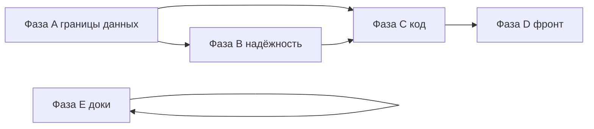

# План перехода: от текущего состояния к целевой архитектуре

| Поле | Значение |
|------|----------|
| **Версия** | 3.0 |
| **Дата** | 2026-03-20 |
| **От** | [CURRENT_SYSTEM_AS_IS.md](CURRENT_SYSTEM_AS_IS.md) |
| **К** | [TARGET_SAAS_CRM_ARCHITECTURE.md](TARGET_SAAS_CRM_ARCHITECTURE.md) |
| **Связанные артефакты** | [TABLE_OWNERSHIP_A1.md](../ai_docs/develop/TABLE_OWNERSHIP_A1.md), [STATE_AND_ROADMAP.md](STATE_AND_ROADMAP.md), [STAGES.md](STAGES.md), [FULL_SYSTEM_AUDIT_2026.md](FULL_SYSTEM_AUDIT_2026.md), [ai_docs/develop/audits/2026-03-18-full-system-audit.md](../ai_docs/develop/audits/2026-03-18-full-system-audit.md) |

Ниже — **дорожная карта фаз**, а не полный бэклог из десятков мелких задач. Критерии сформулированы так, чтобы их можно было проверить ревью кода, поиском по репозиторию и интеграционными тестами.

---

## Промежуточные итоги (сводка)

Актуальная детализация «как в коде» — [CURRENT_SYSTEM_AS_IS.md](CURRENT_SYSTEM_AS_IS.md) (v2.15); целевая модель — [TARGET_SAAS_CRM_ARCHITECTURE.md](TARGET_SAAS_CRM_ARCHITECTURE.md). Ниже — **глобально по фазам A–E**, без дублирования журнала построчно.

### Что в целом уже сдвинуто

| Фаза | Состояние (крупно) |
|------|-------------------|
| **A** | **A1:** список/поиск чатов в messaging без прямого чтения `bd_account_sync_chats` — через internal bd-accounts. **A2:** orphan при удалении BD — основной путь messaging; fallback SQL + метрика + алерт + [RUNBOOK_ORPHAN_MESSAGES.md](RUNBOOK_ORPHAN_MESSAGES.md). **A3:** whitelist в [TABLE_OWNERSHIP_A1.md](../ai_docs/develop/TABLE_OWNERSHIP_A1.md); bypass `message-db.ts` без клиента messaging — метрика `bd_accounts_message_db_sql_bypass_total` + алерт + [DEPLOYMENT.md](DEPLOYMENT.md); опционально **строгий режим** `BD_ACCOUNTS_MESSAGE_DB_STRICT` — запрет bypass (см. DEPLOYMENT); живая логика в `telegram/*`. |
| **B** | **B1/B2:** общий слой HTTP между сервисами (в т.ч. retry/circuit breaker в `ServiceHttpClient`, env `SERVICE_HTTP_*`), DLQ-метрики и правила в Prometheus, разделы в [DEPLOYMENT.md](DEPLOYMENT.md). **B1 (часть):** **messaging** → AI — **65s** (`MESSAGING_AI_HTTP_TIMEOUT_MS`); **automation** → CRM/pipeline — **15s** + `AUTOMATION_CRM_HTTP_TIMEOUT_MS` / `AUTOMATION_PIPELINE_HTTP_TIMEOUT_MS`. **B1 (метрики + алерты):** `inter_service_http_requests_total` / `inter_service_http_circuit_reject_total` при `metricsRegistry` в клиентах (пять сервисов); правила **`InterServiceHttpErrorShareElevated`**, **`InterServiceHttpCircuitReject`** в `alert_rules.yml`. **B1 (аудит):** [SERVICE_HTTP_CLIENT_INVENTORY.md](SERVICE_HTTP_CLIENT_INVENTORY.md). **B3:** кампании — валидация пустой аудитории, мин. интервал между отправками с одного BD, счётчики/алерты. **B4 (часть):** parse **channel + linkedChatId** — `comment-participants`; **channel** без linked + `channelEngagement: 'reactions'` — `reaction-participants` (best-effort; **getMessagesViews** + сортировка по views); **`telegramInvokeWithFloodRetry`** на поиске, участниках/истории, resolve, синке/подгрузке истории, отправке (typing/read/draft/forward), shared-chat, leave, GetFullUser, ResolveUsername (с контекстом); Redis **`parse:progress:{taskId}`** + SSE + **ETA/speed**. См. [PLAN_TELEGRAM_PARSE_FLOW.md](PLAN_TELEGRAM_PARSE_FLOW.md). |
| **C** | **C1:** `parsePageLimit` / `buildPagedResponse` в `@getsale/service-core`. **C2:** вынос SQL/хелперов в messaging (`bd-sync-chats-fetch`, stats/pins queries и т.д.). **C3:** bd-accounts — нарезка `chat-sync*.ts`, `sync.ts` + `sync-routes-*.ts`; `chat-sync.ts` остаётся композицией + `tryAddChatFromSelectedFolders`. **C4 (часть):** bd-accounts, messaging, pipeline (`Pl*`), user (`Us*`), auth (`Au*`), ai (`Ai*`), **crm** — Zod для contact discovery: `DiscoverySearchParamsSchema`, `DiscoveryParseTaskParamsSchema`, `DiscoveryTaskCreateSchema` (discriminatedUnion по `type`); удалён `routes/sync-schemas.ts` в bd-accounts. |
| **D** | **D1–D3:** единый слой `lib/api/bd-accounts`, тип `BDAccount`, аватар; **D4:** разбиение `useMessagingData` на loaders/effects. **Contact discovery (UI):** вкладка поиска — мультивыбор до 10 BD, при нескольких выбранных в `POST /discovery-tasks` уходит `params.accountIds` (иначе `bdAccountId`); «Parse from search» подхватывает `accountIds` из задачи. |
| **E** | **E2/E3:** INDEX/README, ADR в `docs/adr/`, CONTRIBUTING, правило documentation в `.cursor/rules`. |

### Что глобально ещё важно (приоритетный «хвост»)

| Фаза | Что осталось / риск |
|------|---------------------|
| **A** | **A3 (долгосрочно):** убрать SQL-путь в `MessageDb` полностью (только internal API); до этого в проде можно держать **`BD_ACCOUNTS_MESSAGE_DB_STRICT`** — см. [DEPLOYMENT.md](DEPLOYMENT.md). |
| **B** | **B1:** при необходимости уточнить пороги алертов `InterServiceHttp*` под реальный трафик. **B4** — редкие `invoke` без FloodRetry (реакции в UI, фильтры диалогов и т.д.) — по метрикам ([PLAN_TELEGRAM_PARSE_FLOW.md](PLAN_TELEGRAM_PARSE_FLOW.md) §1.1). |
| **C** | **C4 (часть):** централизованный `validation.ts` для **team** (`Tm*`), **analytics** (`An*`), **activity** (`Ac*`); исключение **api-gateway** зафиксировано в [.cursor/rules/backend-standards.mdc](../.cursor/rules/backend-standards.mdc). Остальные сервисы / **C2/C3** — по [CURRENT_SYSTEM_AS_IS.md](CURRENT_SYSTEM_AS_IS.md) §4.2. |
| **D** | Точечный grep на оставшиеся `apiClient` / толстые страницы — по [CURRENT_SYSTEM_AS_IS.md](CURRENT_SYSTEM_AS_IS.md) §5. |
| **E** | **E1:** периодически сверять [STATE_AND_ROADMAP.md](STATE_AND_ROADMAP.md) с репозиторием после крупных шагов. |

**Следующий логичный шаг:** продуктовые пункты [STATE_AND_ROADMAP.md](STATE_AND_ROADMAP.md) §2 по приоритету, **SSE fallback** прогресса парсинга при необходимости, **C4**/рефакторинг — по нагрузке команды.

---

## Фаза A — Границы данных и контракты internal API

**Цель:** Свести к минимуму прямую запись сервисом A в таблицы владельца B; убрать оставшиеся «серые» чтения sync-таблиц из messaging там, где это ещё не сделано.

| # | Действие | Критерий готовности | Риск при откладывании |
|---|----------|---------------------|------------------------|
| A1 | Завершить перевод веток **GET /chats без bdAccountId** и **GET /search** на данные через bd-accounts (или согласованный read-only view под контролем владельца) | В `messaging-service` нет `JOIN bd_account_sync_chats` / `SELECT ... FROM bd_account_sync_chats` в публичных путях списка/поиска (допускается временный feature-flag) | Две правды о составе чатов, сложные миграции схемы |
| A2 | Унифицировать политику **orphan сообщений** при удалении аккаунта: основной путь — только messaging internal; fallback документировать (SRE runbook) или заменить на очередь «retry orphan» | Понятная матрица: когда допустим fallback `UPDATE` из bd-accounts; метрика/алерт при срабатывании fallback | FK-ошибки или «зависшие» сообщения при падении messaging |
| A3 | **`telegram/message-db.ts`:** канонический путь — messaging internal API; SQL без клиента — **задокументированный bypass** с метрикой/алертом (не «тихая» запись) | Whitelist в TABLE_OWNERSHIP §A3; `bd_accounts_message_db_sql_bypass_total` + `BdAccountsMessageDbSqlBypass`; prod держит клиент в `index.ts` | Регрессии правки/удаления в TG vs CRM |

**Артефакты:** обновить [INTERNAL_API.md](INTERNAL_API.md) и [TABLE_OWNERSHIP_A1.md](../ai_docs/develop/TABLE_OWNERSHIP_A1.md) после каждого крупного шага.

---

## Фаза B — Надёжность и нагрузка

**Цель:** Соответствие разделу «Надёжность» целевого документа: устойчивость к сбоям AI/TG, управляемые очереди, лимиты кампаний.

| # | Действие | Критерий готовности | Риск |
|---|----------|---------------------|------|
| B1 | **Retry + circuit breaker** на всех критичных вызовах messaging → AI и messaging → bd-accounts (и симметрично там, где нет) | Конфиг таймаутов в одном месте; тесты или chaos-скрипт не оставляют висящих транзакций | Каскадные 500 в UI при кратком дауне зависимости |
| B2 | **DLQ + метрики** для ключевых очередей RabbitMQ; алерты по глубине и возрасту | Дашборд или минимум Prometheus rules задокументированы в [DEPLOYMENT.md](DEPLOYMENT.md) | Потеря событий без заметности |
| B3 | **Кампании:** лимиты по BD-аккаунту/организации; валидация старта при `contactIds` без `telegram_id` (400 + понятное сообщение) | См. рекомендации [CAMPAIGN_FLOW_AND_LOGS.md](CAMPAIGN_FLOW_AND_LOGS.md); нет «active с 0 участников» без предупреждения | Баны TG, пустой outreach, недоверие к продукту |
| B4 | **Парсинг (долгосрочно):** пагинация SearchGlobal, backoff при flood — по [PLAN_TELEGRAM_PARSE_FLOW.md](PLAN_TELEGRAM_PARSE_FLOW.md) | Этапы плана разбиты на тикеты; прогресс в STATE_AND_ROADMAP | Нестабильный discovery под нагрузкой |

---

## Фаза C — Качество кода и слой данных

**Цель:** Снизить дублирование и размер модулей без смены продуктового поведения в одном большом MR (предпочтительно инкрементально).

| # | Действие | Критерий готовности |
|---|----------|---------------------|
| C1 | Вынести **общую пагинацию** (`parsePageLimit` + формат ответа) в `service-core` или `shared/*` и подключить pipeline, messaging lists, campaign list | Нет копипасты `Math.max/Math.min` для page/limit в трёх сервисах |
| C2 | Ввести **слой репозитория** (или query-модули) для 2–3 самых тяжёлых агрегатов (например список чатов, campaign participant pick) | Роутеры < N строк на handler или вынесенные функции с тестами |
| C3 | Разрезать **`telegram/chat-sync.ts`**, **`routes/sync.ts`** и прочие крупные модули bd-accounts по зонам (подключение, входящие, исходящие, контакты, поиск) — фасад уже **`telegram/index.ts`** | Измеримое снижение размера файлов; без `@ts-nocheck` на новых кусках |
| C4 | Выровнять **validation.ts** по сервисам или ослабить правило в `.cursor/rules` до «схемы рядом с роутом, но не дублировать» | Один источник правды в команде |

---

## Фаза D — Фронтенд: DRY и слой API

**Цель:** Один тип BD-аккаунта, одни хелперы имён/инициалов, единый модуль API.

| # | Действие | Критерий готовности |
|---|----------|---------------------|
| D1 | `frontend/lib/api/bd-accounts.ts` — все вызовы списка/CRUD/статуса | Страницы bd-accounts и ключевые хуки не импортируют `apiClient` для этих путей |
| D2 | Общий тип **`BDAccount`** в `lib/types` или `lib/api/types` | Удалены дубли в `messaging/types` и `bd-accounts/types` или re-export |
| D3 | Один компонент **`AccountAvatar`** с политикой кеша blob | Удалён/обёрнут дубликат в messaging |
| D4 | Разбить **useMessagingData** / толстые `page.tsx` на хуки | Файлы проходят лимит строк из code-quality skill или согласованный лимит команды |

---

## Фаза E — Дисциплина документации

**Цель:** Одна точка входа для новых разработчиков и актуальные даты.

| # | Действие | Критерий готовности |
|---|----------|---------------------|
| E1 | Обновить дату и оглавление в [STATE_AND_ROADMAP.md](STATE_AND_ROADMAP.md); выровнять разделы «сделано / в бэклоге» с репозиторием | Нет противоречия между шапкой и разделом 2026-03-18 |
| E2 | Добавить в [README.md](../README.md) или `docs/INDEX.md` ссылки: TARGET / AS-IS / MIGRATION + ARCHITECTURE + INTERNAL_API | Новый участник находит цель и контракты за 2 клика |
| E3 | **ADR:** канон **`docs/adr/`** ([README](adr/README.md)), процесс в [CONTRIBUTING.md](../CONTRIBUTING.md), правило [.cursor/rules/documentation.md](../.cursor/rules/documentation.md); `ai_docs/develop/architecture/` — только вспомогательные материалы со ссылкой из ADR | Новый участник и агент находят путь без дублирования полного текста |

---

## Порядок выполнения и зависимости

- **A** желательно продвигать первой: от неё зависят смысл метрик и безопасность миграций.
- **B** можно параллелить с A2/A3, если команды разные.
- **C** и **D** не блокируют друг друга, но общие типы удобнее после стабилизации API (A).
- **E** можно делать непрерывно.

---

## Метрики успеха (организационно)

1. После A: нет незадокументированных прямых записей в чужие таблицы (review checklist + grep в CI опционально).
2. После B: инциденты «всё упало из-за AI» не приводят к необработанным 500 на отправке сообщения пользователем.
3. После C/D: снижение дублирования по результатам повторного аудита (те же критерии, что в [CURRENT_SYSTEM_AS_IS.md](CURRENT_SYSTEM_AS_IS.md)).
4. После E: новый разработчик по INDEX находит целевую модель и internal контракты без чтения всей истории аудитов.

---

## Что уже сделано (не повторять как «новую работу»)

Много пунктов из [ai_docs/develop/audits/2026-03-18-full-system-audit.md](../ai_docs/develop/audits/2026-03-18-full-system-audit.md) и [STATE_AND_ROADMAP.md](STATE_AND_ROADMAP.md) уже закрыты: internal edit/delete-by-telegram, приоритет `X-Organization-Id`, `withOrgContext` на ряде путей messaging, хелперы списка чатов, вызов orphan через API и т.д. При планировании спринтов помечать остатки A1/A4 из TABLE_OWNERSHIP как явные follow-up.

---

## Прогресс внедрения (журнал)

| Дата | Что сделано |
|------|-------------|
| 2026-03-20 | **B4 (FloodWait, уточнение):** пауза перед retry = **секунды из ошибки** Telegram (`getRetryAfterSeconds`), верхняя граница **`TELEGRAM_FLOOD_WAIT_CAP_SECONDS`** (default 600, было жёстко 60). [DEPLOYMENT.md](DEPLOYMENT.md), [`telegram-invoke-flood.ts`](../services/bd-accounts-service/src/telegram/telegram-invoke-flood.ts). |
| 2026-03-20 | **B4 (FloodWait):** `telegramInvokeWithFloodRetry` расширен на [`chat-sync-resolve.ts`](../services/bd-accounts-service/src/telegram/chat-sync-resolve.ts), [`message-sync.ts`](../services/bd-accounts-service/src/telegram/message-sync.ts), [`message-sender.ts`](../services/bd-accounts-service/src/telegram/message-sender.ts), [`file-handler.ts`](../services/bd-accounts-service/src/telegram/file-handler.ts) (ResolveUsername с контекстом), [`chat-sync-shared-chat.ts`](../services/bd-accounts-service/src/telegram/chat-sync-shared-chat.ts), [`chat-sync-channel-actions.ts`](../services/bd-accounts-service/src/telegram/chat-sync-channel-actions.ts), [`contact-manager.ts`](../services/bd-accounts-service/src/telegram/contact-manager.ts); опциональный контекст в [`resolve-username.ts`](../services/bd-accounts-service/src/telegram/resolve-username.ts). [PLAN_TELEGRAM_PARSE_FLOW.md](PLAN_TELEGRAM_PARSE_FLOW.md) §1.1, [STATE_AND_ROADMAP.md](STATE_AND_ROADMAP.md). |
| 2026-03-20 | **B4 (часть, bd-accounts):** [`chat-sync-reaction-users.ts`](../services/bd-accounts-service/src/telegram/chat-sync-reaction-users.ts) — опциональный **`messages.getMessagesViews`** (`increment=false`) + сортировка постов с реакциями по **views** перед `GetMessageReactionsList` (списка зрителей MTProto не предоставляет). Доки: [INTERNAL_API.md](INTERNAL_API.md), [PLAN_TELEGRAM_PARSE_FLOW.md](PLAN_TELEGRAM_PARSE_FLOW.md), [STATE_AND_ROADMAP.md](STATE_AND_ROADMAP.md). |
| 2026-03-20 | **D (часть, parse UI):** Discovery — форма парсинга: **`channelEngagement`** для каналов без linked chat; панель прогресса — **ETA** и **скорость** из WebSocket `parse_progress`. Файлы: [`ParseSettingsForm.tsx`](../frontend/components/parsing/ParseSettingsForm.tsx), [`ParseProgressPanel.tsx`](../frontend/components/parsing/ParseProgressPanel.tsx), [`discovery/page.tsx`](../frontend/app/dashboard/discovery/page.tsx), [`lib/api/discovery.ts`](../frontend/lib/api/discovery.ts). Доки: [PLAN_TELEGRAM_PARSE_FLOW.md](PLAN_TELEGRAM_PARSE_FLOW.md), [STATE_AND_ROADMAP.md](STATE_AND_ROADMAP.md). |
| 2026-03-20 | **B1 + B4 + A3 (часть):** Prometheus — алерты **`InterServiceHttpErrorShareElevated`**, **`InterServiceHttpCircuitReject`** (`inter_service_http_*`). **B4:** CRM — `channelEngagement` / стратегия `reaction_users`, bd-accounts **`reaction-participants`** + [`chat-sync-reaction-users.ts`](../services/bd-accounts-service/src/telegram/chat-sync-reaction-users.ts); прогресс parse — **`etaSeconds`**, **`speed`**, `parseStartedAtMs` ([`parse-progress-utils.ts`](../services/crm-service/src/parse-progress-utils.ts), [`discovery-loop.ts`](../services/crm-service/src/discovery-loop.ts), [`parse.ts`](../services/crm-service/src/routes/parse.ts)). **A3:** env **`BD_ACCOUNTS_MESSAGE_DB_STRICT`** — отказ от SQL bypass без messaging-клиента. Доки: [DEPLOYMENT.md](DEPLOYMENT.md), [INTERNAL_API.md](INTERNAL_API.md), [CRM_API.md](CRM_API.md), [PLAN_TELEGRAM_PARSE_FLOW.md](PLAN_TELEGRAM_PARSE_FLOW.md), [TABLE_OWNERSHIP_A1.md](../ai_docs/develop/TABLE_OWNERSHIP_A1.md). `DiscoveryParseTaskParamsSchema` — поле `channelEngagement`. |
| 2026-03-20 | **B1 + B4 + C4 (часть):** `ServiceHttpClient` — опциональный **`metricsRegistry`**, счётчики `inter_service_http_requests_total` / `inter_service_http_circuit_reject_total` ([`http-client.ts`](../shared/service-core/src/http-client.ts), [DEPLOYMENT.md](DEPLOYMENT.md)); подключено в bd-accounts, messaging, crm, campaign, automation. **B4:** [`telegram-invoke-flood.ts`](../services/bd-accounts-service/src/telegram/telegram-invoke-flood.ts) + [`chat-sync-comment-participants.ts`](../services/bd-accounts-service/src/telegram/chat-sync-comment-participants.ts), маршрут `comment-participants`, CRM [`discovery-loop.ts`](../services/crm-service/src/discovery-loop.ts) стратегия `comment_replies`; Redis `parse:progress:{taskId}` + SSE subscribe в [`parse.ts`](../services/crm-service/src/routes/parse.ts); [`RedisClient.duplicateSubscriber`](../shared/utils/src/redis.ts). **C4:** `validation.ts` в team / analytics / activity; правило [.cursor/rules/backend-standards.mdc](../.cursor/rules/backend-standards.mdc). [INTERNAL_API.md](INTERNAL_API.md), [PLAN_TELEGRAM_PARSE_FLOW.md](PLAN_TELEGRAM_PARSE_FLOW.md). [CURRENT_SYSTEM_AS_IS.md](CURRENT_SYSTEM_AS_IS.md) v2.15; версия **3.0**. |
| 2026-03-20 | **B1 + B4 (часть):** [SERVICE_HTTP_CLIENT_INVENTORY.md](SERVICE_HTTP_CLIENT_INVENTORY.md) — аудит `new ServiceHttpClient` (только bd-accounts, messaging, crm, campaign, automation); ссылки из [INDEX.md](INDEX.md), [INTERNAL_API.md](INTERNAL_API.md). **B4:** [`chat-sync-search.ts`](../services/bd-accounts-service/src/telegram/chat-sync-search.ts) — `telegramInvokeWithFloodRetry` (FLOOD_WAIT на `invoke`, один повтор, cap 60s) для SearchGlobal, SearchPosts, `contacts.Search`, `GetAdminedPublicChannels`. [PLAN_TELEGRAM_PARSE_FLOW.md](PLAN_TELEGRAM_PARSE_FLOW.md) §1.1 + раздел «B4: оставшийся порядок работ». [CURRENT_SYSTEM_AS_IS.md](CURRENT_SYSTEM_AS_IS.md) v2.14; версия **2.9**. |
| 2026-03-20 | **B1 (часть):** [`automation-service` `index.ts`](../services/automation-service/src/index.ts) — таймауты CRM/pipeline через **`AUTOMATION_CRM_HTTP_TIMEOUT_MS`** / **`AUTOMATION_PIPELINE_HTTP_TIMEOUT_MS`** (по умолчанию 15s, мин. 3s); убран дублирующий `retries: 2` (остаётся из `interServiceHttpDefaults`). [INTERNAL_API.md](INTERNAL_API.md) §8–9, [DEPLOYMENT.md](DEPLOYMENT.md). [CURRENT_SYSTEM_AS_IS.md](CURRENT_SYSTEM_AS_IS.md) v2.13; версия **2.8**. |
| 2026-03-20 | **B1 (часть):** [`messaging-service` `index.ts`](../services/messaging-service/src/index.ts) — `ServiceHttpClient` к AI с **timeout 65s** по умолчанию и env **`MESSAGING_AI_HTTP_TIMEOUT_MS`** (мин. 5000 мс); [INTERNAL_API.md](INTERNAL_API.md) §5, [DEPLOYMENT.md](DEPLOYMENT.md). [CURRENT_SYSTEM_AS_IS.md](CURRENT_SYSTEM_AS_IS.md) v2.12; версия **2.7**. |
| 2026-03-20 | **D (часть):** страница [`discovery/page.tsx`](../frontend/app/dashboard/discovery/page.tsx) — мультивыбор BD для задачи поиска (`accountIds` vs `bdAccountId`); «Parse from search» переносит `accountIds` из `task.params` в шаг настроек парсинга; удалён неиспользуемый legacy `handleCreateParseTask`. [CRM_API.md](CRM_API.md) — уточнение про UI. [CURRENT_SYSTEM_AS_IS.md](CURRENT_SYSTEM_AS_IS.md) v2.11; версия **2.6**. |
| 2026-03-20 | **C4 (часть, crm) + E:** Zod для `POST /api/crm/discovery-tasks`: [`validation.ts`](../services/crm-service/src/validation.ts) — `DiscoverySearchParamsSchema` / `DiscoveryParseTaskParamsSchema`, `accountIds` (1–10) для поиска и парсинга-задачи; `total` при создании parse-задачи учитывает `sources`. [CRM_API.md](CRM_API.md) — раздел Contact discovery. [CURRENT_SYSTEM_AS_IS.md](CURRENT_SYSTEM_AS_IS.md) v2.10; версия миграции **2.5**. |
| 2026-03-20 | **B4 (часть, этап 3 CRM) + B1 (часть):** в [`discovery-loop.ts`](../services/crm-service/src/discovery-loop.ts) — ротация BD при **429 / 502 / 503** для `search-groups`, `participants` / `active-participants`, `leave` (несколько `accountIds` или один); [`crm-service` `index.ts`](../services/crm-service/src/index.ts) — клиент bd-accounts без `retries: 0`, используются defaults `SERVICE_HTTP_*`. Обновлены [PLAN_TELEGRAM_PARSE_FLOW.md](PLAN_TELEGRAM_PARSE_FLOW.md), [CURRENT_SYSTEM_AS_IS.md](CURRENT_SYSTEM_AS_IS.md) (v2.9), сводка фазы **B** здесь, [STATE_AND_ROADMAP.md](STATE_AND_ROADMAP.md); версия **2.4**. |
| 2026-03-20 | **Док / B4:** сверка с кодом — этап 2 плана парсинга уже в репозитории (`parse/resolve`, `ResolvedSource`, CRM `parse.ts`); уточнены этапы 3–4 (частично vs бэклог). Обновлены [PLAN_TELEGRAM_PARSE_FLOW.md](PLAN_TELEGRAM_PARSE_FLOW.md) §2 (статус), [INTERNAL_API.md](INTERNAL_API.md), [ARCHITECTURE.md](ARCHITECTURE.md), [STATE_AND_ROADMAP.md](STATE_AND_ROADMAP.md); версия миграции **2.3**. |
| 2026-03-20 | **B4 (часть, этап 1 поиск):** `GET .../search-groups` — query **`maxPages`** (1–15, default 10) прокидывается в `searchGroupsByKeyword` / `searchPublicChannelsByKeyword` ([`sync-routes-discovery.ts`](../services/bd-accounts-service/src/routes/sync-routes-discovery.ts)); обновлены [PLAN_TELEGRAM_PARSE_FLOW.md](PLAN_TELEGRAM_PARSE_FLOW.md) §1.1 (таблица статуса), [INTERNAL_API.md](INTERNAL_API.md), [ARCHITECTURE.md](ARCHITECTURE.md). |
| 2026-03-20 | **E1:** [STATE_AND_ROADMAP.md](STATE_AND_ROADMAP.md) синхронизирован с планом миграции и кодом: новый §**1.10** (фазы A–E кратко), исправлены противоречия (orphan fallback, Campaign как существующий сервис, 2FA vs «MFA не сделано»), обновлены §2–§3 (B1/B4, инфра/метрики, приоритеты). |
| 2026-03-20 | **Док (C1 / as-is):** [CURRENT_SYSTEM_AS_IS.md](CURRENT_SYSTEM_AS_IS.md) §4.1 и строка CRM в §2 приведены в соответствие с кодом: `parsePageLimit` / `buildPagedResponse` в **service-core**, использование в pipeline/messaging/campaign/CRM; отмечены остатки локального лимита (например поиск чатов в messaging). Версия as-is **2.8**. |
| 2026-03-20 | **C4 (часть, ai-service):** Zod вынесен в [`validation.ts`](../services/ai-service/src/validation.ts) (`AiDraftGenerateSchema`, `AiGenerateSearchQueriesSchema`, `AiCampaignRephraseSchema`); импорты в `routes/drafts`, `search-queries`, `campaign-rephrase`. |
| 2026-03-20 | **C4 (часть, auth-service):** Zod вынесен в [`validation.ts`](../services/auth-service/src/validation.ts) (`Au*` + `auEmailSchema` для `validateEmailAndPassword`); импорты в `routes/auth`, `organization`, `workspaces`, `invites`, `two-factor`. |
| 2026-03-20 | **C4 (часть, user-service):** Zod для `PUT /profile` и `POST /subscription/upgrade` в [`validation.ts`](../services/user-service/src/validation.ts) (`UsProfileUpdateSchema`, `UsSubscriptionUpgradeSchema`); импорты в `routes/profiles.ts`, `subscription.ts`. |
| 2026-03-20 | **C4 (часть, pipeline-service):** Zod для `pipelines`, `stages`, `POST .../leads` вынесены в [`validation.ts`](../services/pipeline-service/src/validation.ts) (префикс `Pl*`); импорты в `routes/pipelines.ts`, `stages.ts`, `leads.ts`. |
| 2026-03-20 | **A3 (наблюдаемость):** bypass `telegram/message-db.ts` при отсутствии HTTP-клиента messaging — счётчик **`bd_accounts_message_db_sql_bypass_total{operation}`**, одно предупреждение в лог на тип операции (`message_db_sql_bypass`), передача счётчика из `index.ts` → `TelegramManager` → `MessageDb`; алерт **`BdAccountsMessageDbSqlBypass`** в `infrastructure/prometheus/alert_rules.yml`; раздел в [DEPLOYMENT.md](DEPLOYMENT.md); уточнение whitelist в [TABLE_OWNERSHIP_A1.md](../ai_docs/develop/TABLE_OWNERSHIP_A1.md). |
| 2026-03-20 | **C4 (часть, messaging-service):** Zod-схемы для `messages-send`, `shared-chats`, `conversation-deals` и internal (`ensure`, `create message`, edit/delete/orphan by telegram) вынесены в [`validation.ts`](../services/messaging-service/src/validation.ts); префикс `Msg*` для публичных/internal схем; роуты импортируют оттуда (`safeParse` в `internal.ts` без изменения поведения). |
| 2026-03-20 | **C4 (часть, bd-accounts):** все Zod-схемы публичных роутов сведены в [`validation.ts`](../services/bd-accounts-service/src/validation.ts); импорты в `accounts`, `auth`, `messaging`, `sync-routes-*`; `routes/sync-schemas.ts` удалён (схемы перенесены в `validation.ts`). |
| 2026-03-20 | **Док:** раздел **«Промежуточные итоги (сводка)»** по фазам A–E; версия документа **1.2**. |
| 2026-03-20 | **C3 (часть):** [`routes/sync.ts`](../services/bd-accounts-service/src/routes/sync.ts) — тонкий монтаж; обработчики вынесены в [`sync-routes-dialogs-read.ts`](../services/bd-accounts-service/src/routes/sync-routes-dialogs-read.ts), [`sync-routes-folders-write.ts`](../services/bd-accounts-service/src/routes/sync-routes-folders-write.ts), [`sync-routes-chats-sync.ts`](../services/bd-accounts-service/src/routes/sync-routes-chats-sync.ts), [`sync-routes-discovery.ts`](../services/bd-accounts-service/src/routes/sync-routes-discovery.ts); общие зависимости — [`sync-route-deps.ts`](../services/bd-accounts-service/src/routes/sync-route-deps.ts). Порядок регистрации маршрутов как в монолите. **Следующий C3-слайс:** другие толстые роутеры bd-accounts при необходимости; **C4** — `validation.ts`. |
| 2026-03-20 | **C3 (часть):** диалоги и папки — [`chat-sync-dialogs.ts`](../services/bd-accounts-service/src/telegram/chat-sync-dialogs.ts) (`getDialogs`/`getDialogsAll`, кеш `GetDialogFilters`, `pushFoldersToTelegram`, `getDialogsByFolder`, статические хелперы фильтрации); канал/сообщения — [`chat-sync-channel-actions.ts`](../services/bd-accounts-service/src/telegram/chat-sync-channel-actions.ts) (`leaveChat`, revoke-delete); общий чат — [`chat-sync-shared-chat.ts`](../services/bd-accounts-service/src/telegram/chat-sync-shared-chat.ts) (`createSharedChatGlobal`). [`telegram/index.ts`](../services/bd-accounts-service/src/telegram/index.ts) — `TelegramManager.dialogMatchesFilter` / `getFilterIncludeExcludePeerIds` делегируют в `chat-sync-dialogs`. [`chat-sync.ts`](../services/bd-accounts-service/src/telegram/chat-sync.ts) — композиция и **`tryAddChatFromSelectedFolders`** (SQL + `ContactManager`). **Следующий C3-слайс:** нарезка **`routes/sync.ts`**, затем **C4** (`validation.ts`). |
| 2026-03-20 | **C3 (часть):** участники и resolve вынесены: [`chat-sync-participants.ts`](../services/bd-accounts-service/src/telegram/chat-sync-participants.ts), [`chat-sync-resolve.ts`](../services/bd-accounts-service/src/telegram/chat-sync-resolve.ts); `resolveSourceFromInput` сохраняет fallback при «нет клиента» после базового resolve. |
| 2026-03-20 | **C3 (часть):** `contacts.Search` и `channels.GetAdminedPublicChannels` вынесены в [`chat-sync-search.ts`](../services/bd-accounts-service/src/telegram/chat-sync-search.ts) (`searchByContactsGlobal`, `getAdminedPublicChannelsGlobal`); [`chat-sync.ts`](../services/bd-accounts-service/src/telegram/chat-sync.ts) — проверка клиента и делегирование. |
| 2026-03-20 | **C3 (часть):** публичный поиск каналов (`channels.SearchPosts`, query/hashtag) вынесен в [`chat-sync-search.ts`](../services/bd-accounts-service/src/telegram/chat-sync-search.ts) (`searchPublicChannelsByKeywordGlobal`); `ChatSync.searchPublicChannelsByKeyword` — делегирование. Ранее в том же файле — `searchGroupsByKeywordGlobal` (SearchGlobal). |
| 2026-03-20 | **C3 (часть):** глобальный поиск групп/каналов (`SearchGlobal`) вынесен в [`chat-sync-search.ts`](../services/bd-accounts-service/src/telegram/chat-sync-search.ts) (`searchGroupsByKeywordGlobal`); [`chat-sync.ts`](../services/bd-accounts-service/src/telegram/chat-sync.ts) делегирует из `searchGroupsByKeyword` — публичный API фасада без изменений. [PLAN_TELEGRAM_PARSE_FLOW.md](PLAN_TELEGRAM_PARSE_FLOW.md) §1.1 — уточнены пути. |
| 2026-03-20 | **B3 + E3:** алерт Prometheus **`CampaignMinGapDeferElevated`** (`infrastructure/prometheus/alert_rules.yml`) для роста `campaign_min_gap_defer_total`; упоминание в [DEPLOYMENT.md](DEPLOYMENT.md). **E3 (закрыто):** [docs/adr/README.md](adr/README.md), корневой [CONTRIBUTING.md](../CONTRIBUTING.md), ссылки в [INDEX.md](INDEX.md), [README.md](../README.md), [.cursor/rules/documentation.md](../.cursor/rules/documentation.md). |
| 2026-03-20 | **Техдолг + наблюдаемость:** удалён неиспользуемый `services/bd-accounts-service/src/telegram-manager.ts` (~5k строк); актуальный код — `telegram/*`. **B3:** счётчик Prometheus `campaign_min_gap_defer_total` в [`campaign-service`](../services/campaign-service/src/metrics.ts), регистрация в [`index.ts`](../services/campaign-service/src/index.ts); см. [DEPLOYMENT.md](DEPLOYMENT.md). **A3 (проверка):** delete/edit в [`event-handlers.ts`](../services/bd-accounts-service/src/telegram/event-handlers.ts) уже через `MessageDb` → internal messaging при `messagingClient`. Доки: [TABLE_OWNERSHIP_A1.md](../ai_docs/develop/TABLE_OWNERSHIP_A1.md), [PLAN_TELEGRAM_PARSE_FLOW.md](PLAN_TELEGRAM_PARSE_FLOW.md), фазы A3/C3 в этой таблице — обновлены под `telegram/*`. |
| 2026-03-20 | **B3 (часть):** `CAMPAIGN_MIN_GAP_MS_SAME_BD_ACCOUNT` — минимальный интервал между успешными кампейными отправками с одного BD-аккаунта в рамках батча воркера (`campaign-loop.ts`); таблица env в [DEPLOYMENT.md](DEPLOYMENT.md). **Границы (A3/док):** [TABLE_OWNERSHIP_A1.md](../ai_docs/develop/TABLE_OWNERSHIP_A1.md) — уточнение: живой код в `telegram/*`, `telegram-manager.ts` не в графе импорта. **Техдолг/док:** [CURRENT_SYSTEM_AS_IS.md](CURRENT_SYSTEM_AS_IS.md) — синхронизация с фронтом, фасадом Telegram, кампаниями (см. также следующую строку журнала: удаление legacy-файла). |
| 2026-03-20 | **C2 (часть):** SQL для `GET /stats` и CRUD pinned-chats вынесены в [`chats-stats-and-pins-queries.ts`](../services/messaging-service/src/chats-stats-and-pins-queries.ts); [`routes/chats.ts`](../services/messaging-service/src/routes/chats.ts) остаётся HTTP-слоем. **D4 (часть):** [`useMessagingData`](../frontend/app/dashboard/messaging/hooks/useMessagingData.ts) — композиция [`useMessagingDataLoaders`](../frontend/app/dashboard/messaging/hooks/useMessagingDataLoaders.ts) (callbacks + ref) и [`useMessagingDataEffects`](../frontend/app/dashboard/messaging/hooks/useMessagingDataEffects.ts) (все `useEffect`); публичный API хука без изменений. WebSocket по решению оставлен без отложенного подключения. |
| 2026-03-20 | **C2 (часть):** вызовы `GET /internal/sync-chats` из `messaging-service` вынесены в [`bd-sync-chats-fetch.ts`](../services/messaging-service/src/bd-sync-chats-fetch.ts); [`routes/chats.ts`](../services/messaging-service/src/routes/chats.ts) только оркестрирует org-context, SQL-хелперы и маппинг ошибок. **D2/D3:** тип `BDAccount` — только `frontend/lib/types/bd-account.ts`; аватар — один компонент `BdAccountAvatar`, `messaging/BDAccountAvatar` — реэкспорт (дубликата UI нет). **E2:** [README](../README.md) уже ссылается на [INDEX.md](INDEX.md) и целевые доки. |
| 2026-03-20 | **B3:** при старте кампании с явным списком `contactIds`, если после фильтра по Telegram не осталось контактов — `400` с понятным текстом ([execution.ts](../services/campaign-service/src/routes/execution.ts)). |
| 2026-03-20 | **C1 (часть):** `parsePageLimit` и `buildPagedResponse` перенесены в `@getsale/service-core`; CRM реэкспортирует из `helpers` для обратной совместимости. Сборка `shared/service-core` обновляет `dist` для потребителей. |
| 2026-03-20 | **D1–D3 (часть):** `frontend/lib/api/bd-accounts.ts`, общий тип `lib/types/bd-account.ts`, хелперы отображения `lib/bd-account-display.ts`, единый `components/bd-accounts/BdAccountAvatar.tsx` (кеш blob); список/CRUD на страницах bd-accounts, хук messaging, discovery, pipeline, ContactDetail переведены на модуль API где уместно. |
| 2026-03-20 | **D1 (часть):** расширен `lib/api/bd-accounts.ts` (sync-folders/status/start, draft, avatar blob, чаты/папки/forward/load-older); `BdSyncFolder` + `BDAccountProxyConfig` в `lib/types/bd-account.ts`; страница `bd-accounts/[id]`, `useMessagingData`, `useMessagingActions` без прямого `apiClient` на этих путях. |
| 2026-03-20 | **D / UX нагрузка:** убран дублирующий `refreshUser()` из `DashboardLayout` (сессия уже в `app/dashboard/layout.tsx` через `/api/auth/me`); `fetchWorkspaces` через `runWhenIdle`; напоминания в шапке — первая загрузка с задержкой + интервал 60s + немедленный fetch при открытии дропдауна; глобальный поиск не бьёт в API пока панель закрыта; `prefetch={false}` на ключевых `Link` (сайдбар, хлебные крошки, главная). См. `frontend/lib/run-when-idle`. |
| 2026-03-20 | **D1 (продолжение):** `useBdAccountsConnect` переведён на `lib/api/bd-accounts` (send-code, verify-code, QR, dialogs-by-folders refresh, sync-chats, sync-start); типы мастера подключения в `lib/types/bd-connect.ts`; `fetchBdAccountChatAvatarBlob` + `isLikelyAvatarImageBlob` — `ChatAvatar`, `DealChatAvatar`, `LeadAvatar`. |
| 2026-03-20 | **D1 (завершение следа BD API на фронте):** `lib/api/discovery.ts` — тонкие обёртки над `searchBdAccountTelegramGroups`, `listBdAccountAdminedPublicChannels`, `resolveBdAccountChatInputs`; `enrichContactsFromTelegram` в campaigns → `enrichContactsViaBdAccounts`; рассылка в группы — `postBdAccountSendBulk`; медиа URL — `getBdAccountMediaProxyUrl` (`messaging/utils`); `BdAccountAvatar` — `fetchBdAccountAvatarBlob`. Все пути `/api/bd-accounts` для продуктового UI сходятся в `lib/api/bd-accounts.ts`. |
| 2026-03-20 | **A3 (док):** whitelist прямых мутаций `messages` из bd-accounts в [TABLE_OWNERSHIP_A1.md](../ai_docs/develop/TABLE_OWNERSHIP_A1.md) (A3). |
| 2026-03-20 | **A2 (док):** [RUNBOOK_ORPHAN_MESSAGES.md](RUNBOOK_ORPHAN_MESSAGES.md) — политика fallback при удалении аккаунта. |
| 2026-03-20 | **A2 (часть):** метрика `bd_accounts_messaging_orphan_fallback_total` + алерт `BdAccountsMessagingOrphanFallback`; обновлены [RUNBOOK_ORPHAN_MESSAGES.md](RUNBOOK_ORPHAN_MESSAGES.md), [DEPLOYMENT.md](DEPLOYMENT.md). |
| 2026-03-20 | **E:** обновлена дата в [STATE_AND_ROADMAP.md](STATE_AND_ROADMAP.md); добавлен [INDEX.md](INDEX.md). |
| 2026-03-20 | **A1 (закрыто для messaging):** `messaging-service` не читает `bd_account_sync_chats`. GET `/chats` без `bdAccountId` — JSON из нескольких `GET /internal/sync-chats` + `json_to_recordset`. GET `/search` — `GET /internal/search-sync-chats` в bd-accounts. См. [TABLE_OWNERSHIP_A1.md](../ai_docs/develop/TABLE_OWNERSHIP_A1.md) этап 4b, [INTERNAL_API.md](INTERNAL_API.md). |
| 2026-03-20 | **B1 (часть) + C1 (часть):** `interServiceHttpDefaults()` в `@getsale/service-core` + env `SERVICE_HTTP_*`; клиенты в messaging, bd-accounts, campaign, crm, automation используют общий базовый слой (с сохранением локальных override: CRM/campaign 60s/0 retries, AI 65s, automation 15s). Пагинация: `parsePageLimit` / `buildPagedResponse` / `parseLimit` на списках pipeline leads, campaign list, participants, messaging messages; picker — `parseLimit`. См. [DEPLOYMENT.md](DEPLOYMENT.md). |
| 2026-03-20 | **B2 (часть):** метрика `rabbitmq_dlq_messages_total` регистрируется в registry сервисов (видна на `/metrics`); алерт `RabbitMqConsumerDlq` в `infrastructure/prometheus/alert_rules.yml`; раздел RabbitMQ/DLQ в [DEPLOYMENT.md](DEPLOYMENT.md). **Исправление:** `messaging-service` — один consumer на очередь `messaging-service` (объединены подписки на `LEAD_CREATED_FROM_CAMPAIGN` и `BD_ACCOUNT_TELEGRAM_UPDATE`). |
