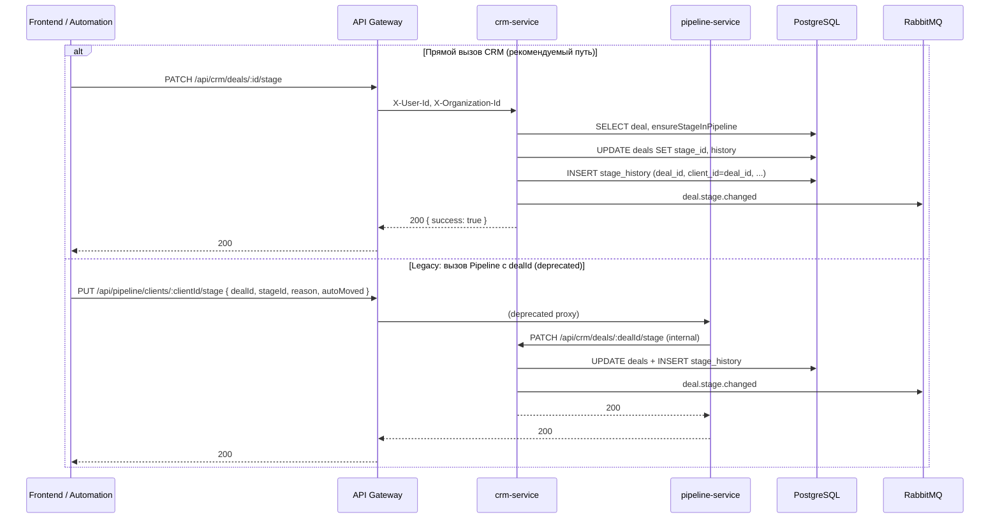

# ЭТАП 1 — План: Единственный источник истины для смены стадии сделки

**Роль:** Principal Architect + Lead Backend Engineer  
**Дата:** 2025-02-23  
**Статус:** Подтверждён → Реализация

---

## 0. Подтверждённые решения

1. **Single Source of Truth** для смены стадии сделки — **CRM** (`PATCH /api/crm/deals/:id/stage`). Deal — доменная сущность CRM; Pipeline — оркестратор стадий, не владелец сделки.

2. **Pipeline endpoint** при наличии `dealId` делает **proxy** в CRM, но:
   - помечается как **@deprecated**;
   - в комментарии указано, что будет удалён после миграции (ЭТАП 2).

3. **stage_history.client_id**: на ЭТАПЕ 1 допускается **transitional** решение: для сделки `client_id = deal_id`. В коде — TODO; нормализация (entity_type/entity_id или отдельные таблицы) запланирована в **ЭТАПЕ 2** (см. STAGE_2_PLAN.md).

---

## 1. Текущее состояние (as-is)

### 1.1 Кто меняет стадию сделки

| Место | Действие | deals.stage_id | deals.history (JSONB) | stage_history | Событие |
|-------|----------|----------------|----------------------|---------------|---------|
| **CRM** `PATCH /api/crm/deals/:id/stage` | Обновляет | ✅ | ✅ append | ❌ не пишет | ✅ deal.stage.changed |
| **Pipeline** `PUT /api/pipeline/clients/:clientId/stage` (body.dealId) | Обновляет | ✅ | ❌ не пишет | ✅ INSERT | ✅ deal.stage.changed |

Итог: два независимых пути; при смене через CRM в `stage_history` ничего не попадает; при смене через Pipeline в `deals.history` ничего не попадает. Analytics/отчёты могут опираться на `stage_history` — тогда смены из CRM «невидимы».

### 1.2 Кто кого вызывает

- **Frontend (pipeline Kanban):** только CRM — `updateDealStage(id, { stageId })` → `PATCH /api/crm/deals/:id/stage`.  
- **Automation-service:** только Pipeline — `PUT /api/pipeline/clients/${clientId|contactId}/stage` с `body.dealId`, `autoMoved: true`.  
- Других вызовов смены стадии сделки в репозитории не найдено.

### 1.3 Схема БД (релевантное)

- **deals:** `id`, `stage_id`, `history` (JSONB). Колонки `client_id` в таблице `deals` **нет** (есть только `contact_id`).
- **stage_history:** `client_id` (NOT NULL), `deal_id` (nullable FK на deals.id), `from_stage_id`, `to_stage_id`, `moved_by`, `auto_moved`, `reason`.

В Pipeline в коде используется условие `deals WHERE id = $1 OR client_id = $1` — ссылка на несуществующую колонку (фактически срабатывает только `id`).

---

## 2. Архитектурное решение: кто владеет сменой стадии сделки

### 2.1 Варианты

**Вариант A — CRM как единственный источник истины (рекомендуется)**

- Владелец сущности Deal — CRM; смена стадии — изменение атрибута сделки с записью истории.
- Один endpoint: `PATCH /api/crm/deals/:id/stage`. Он:
  - обновляет `deals.stage_id`;
  - дописывает запись в `deals.history`;
  - пишет одну запись в `stage_history` (для аналитики и единой истории переходов);
  - один раз публикует `deal.stage.changed`.
- Pipeline для сделок стадию больше не меняет: endpoint `PUT /api/pipeline/clients/:clientId/stage` для случая с `dealId` либо удаляется, либо оставляется как deprecated-прокси к CRM (см. ниже).

Плюсы: граница владения ясная (Deal = CRM), минимум изменений в фронте (уже идёт в CRM), одна точка записи.  
Минус: CRM начинает писать в таблицу `stage_history`, которая исторически ассоциирована с Pipeline (в той же БД — допустимо).

**Вариант B — Pipeline как единственный источник истины**

- Единственный endpoint смены стадии сделки — в Pipeline (например `PUT /api/pipeline/deals/:dealId/stage`).
- Pipeline обновляет `deals.stage_id`, дописывает `deals.history` и пишет в `stage_history`, публикует событие.
- CRM `PATCH /api/crm/deals/:id/stage` становится прокси: вызывает Pipeline и возвращает результат.

Плюсы: все переходы по стадиям в одном сервисе.  
Минусы: Pipeline трогает таблицу `deals` и поле `deals.history` (чужая сущность); фронт и автоматизации нужно перевести на новый URL или оставить прокси в CRM.

### 2.2 Рекомендация: Вариант A (CRM — единственный источник истины)

- Сделка и её атрибуты (в т.ч. `stage_id`, `history`) остаются в зоне ответственности CRM.
- `stage_history` трактуется как общий аудит-лог переходов по стадиям; писать в него при смене стадии сделки может CRM (та же БД).
- Обратная совместимость: фронт уже использует CRM; нужно только перевести automation-service на вызов CRM вместо Pipeline и решить судьбу Pipeline endpoint (deprecate или proxy).

---

## 3. Целевое поведение (to-be) после ЭТАПА 1

### 3.1 Один путь смены стадии сделки

- Единственный endpoint, который меняет стадию сделки: **`PATCH /api/crm/deals/:id/stage`** (body: `stageId`, опционально `reason`).
- В одном месте (в CRM) выполняется:
  1. Валидация (сделка есть, stage принадлежит pipeline сделки, организация).
  2. Обновление: `UPDATE deals SET stage_id = $1, history = $2, updated_at = NOW() WHERE id = $3`.
  3. Запись аудита: `INSERT INTO stage_history (client_id, deal_id, from_stage_id, to_stage_id, moved_by, auto_moved, reason) VALUES (...)`.
- Семантика `stage_history` для сделки:
  - `deal_id` = id сделки;
  - `client_id` = id сущности, которую «переместили». Для сделки логично положить **deal_id** в `client_id` (то же значение), чтобы не вводить пока отдельную семантику «client = contact».
- Одно событие: `deal.stage.changed` (payload: dealId, fromStageId, toStageId, reason; при необходимости — performedBy, autoMoved).
- Другие сервисы (analytics, automation, websocket) продолжают подписаны на `deal.stage.changed`; изменений в контракте события не требуется.

### 3.2 Расширение контракта CRM (обратная совместимость)

- Body `PATCH /api/crm/deals/:id/stage` расширить опциональным полем **`autoMoved?: boolean`** (по умолчанию false). Тогда automation-service при вызове CRM сможет передать `autoMoved: true` и reason — в `stage_history` и в событии это будет видно. Существующие вызовы без `autoMoved` не ломаются.

### 3.3 Судьба Pipeline `PUT /api/pipeline/clients/:clientId/stage`

- **Вариант 3.3.1 (предпочтительный):** Пометить как **deprecated** и для случая «это перемещение сделки» перенаправлять на CRM.
  - Если в body передан `dealId` (или `clientId` в path совпадает с существующим deal.id в организации):
    - выполнять внутри Pipeline вызов CRM: `PATCH /api/crm/deals/:dealId/stage` с теми же stageId, reason, autoMoved;
    - возвращать клиенту ответ CRM (или 204/200 после успеха);
    - в `stage_history` и `deals.history` пишет только CRM — дублирования нет.
  - Если `dealId` нет и `clientId` не сделка — текущее поведение можно оставить для обратной совместимости (перемещение «клиента» без сделки; при необходимости уточнить в ЭТАПЕ 2).
- **Вариант 3.3.2:** Не трогать логику Pipeline в ЭТАПЕ 1, но перевести **только automation-service** на вызов CRM. Pipeline endpoint оставить как есть и вывести из употребления в ЭТАПЕ 2 (вместе с исправлением client_id).

Рекомендация: 3.3.1 — один раз в Pipeline сделать прокси для deal → CRM, чтобы любой старый вызов с `dealId` вёл к одной точке истины и записывал в `stage_history` и `deals.history` через CRM.

### 3.4 Automation-service

- Вместо вызова Pipeline вызывать CRM: `PATCH {CRM_SERVICE_URL}/api/crm/deals/${dealId}/stage` с заголовками `X-User-Id`, `X-Organization-Id` (из события или системный пользователь) и body `{ stageId: action.targetStageId, reason: '...', autoMoved: true }`.
- Использовать `event.data?.dealId`; если в событии приходит только `clientId`/`contactId`, в ЭТАПЕ 1 оставить fallback на текущий вызов Pipeline (до тех пор пока все триггеры не будут отдавать dealId), либо явно зафиксировать в документации, что для автоматического перемещения сделки в событии должен быть dealId.

---

## 4. Пошаговый план реализации (без кода, только шаги)

### Шаг 1. CRM: запись в stage_history при PATCH /api/crm/deals/:id/stage

- В обработчике после обновления `deals.stage_id` и `deals.history` добавить один `INSERT` в `stage_history`:
  - `deal_id` = id сделки;
  - `client_id` = id сделки (единообразно для сделок; см. ЭТАП 2 для уточнения семантики);
  - `from_stage_id`, `to_stage_id` = текущая и новая стадия;
  - `moved_by` = user.id из запроса;
  - `auto_moved` = из body (по умолчанию false);
  - `reason` = из body.
- Добавить в комментарий в коде: `// SINGLE SOURCE OF TRUTH FOR DEAL STAGE TRANSITIONS`.
- Опционально: расширить body схемы (Zod) полем `autoMoved?: boolean`.

### Шаг 2. CRM: контракт PATCH body

- В validation (DealStageUpdateSchema) добавить необязательное поле `autoMoved?: boolean`.
- В обработчике передавать его в `stage_history` и при необходимости в payload события (если подписчики используют).

### Шаг 3. Pipeline: прокси для сделок (PUT /api/pipeline/clients/:clientId/stage)

- В начале обработчика: если в body передан `dealId` (или по clientId можно однозначно определить сделку в этой организации), не выполнять свою логику обновления deals/stage_history, а:
  - вызвать CRM (внутренний HTTP) `PATCH /api/crm/deals/{dealId}/stage` с stageId, reason, autoMoved из body;
  - вернуть ответ CRM клиенту (статус и тело или только успех).
- Если вызов CRM недоступен — вернуть 502/503 с понятным сообщением.
- Добавить комментарий в коде: при наличии dealId смена стадии выполняется в CRM (single source of truth).
- Опционально: в ответе или логах помечать, что использован proxy to CRM.

### Шаг 4. Automation-service: вызов CRM вместо Pipeline

- В функции, которая выполняет действие «move to stage», определять, есть ли в event `dealId`.
- Если есть — вызывать CRM `PATCH /api/crm/deals/:dealId/stage` с заголовками X-User-Id, X-Organization-Id (взять из event.organizationId и при необходимости получить system user id для организации) и body stageId, reason, autoMoved: true.
- Если dealId нет — оставить текущий вызов Pipeline (для lead/contact, если такой сценарий есть) или залогировать предупреждение и не вызывать Pipeline для «неизвестного» типа.

### Шаг 5. Документация и комментарии

- В `docs/CRM_API.md`: указать, что смена стадии сделки выполняется только через `PATCH /api/crm/deals/:id/stage`; при этом обновляются deals.stage_id, deals.history и делается запись в stage_history; публикуется deal.stage.changed.
- В коде CRM в месте обновления стадии оставить явный комментарий: `// SINGLE SOURCE OF TRUTH FOR DEAL STAGE TRANSITIONS`.
- В аудите или STAGE_1 документе зафиксировать итоговый flow (см. ниже).

---

## 5. Итоговый flow смены стадии (после ЭТАПА 1)

```
[Все смены стадии сделки]

  Frontend / Automation / любой клиент
           │
           ├──► PATCH /api/crm/deals/:id/stage  ──────────────────────────┐
           │         (предпочтительный путь)                              │
           │                                                              ▼
           │    ┌──────────────────────────────────────────────────────────────────┐
           │    │ CRM (SINGLE SOURCE OF TRUTH FOR DEAL STAGE TRANSITIONS)          │
           │    │ 1. Проверка deal, stage, organization                            │
           │    │ 2. UPDATE deals SET stage_id, history                            │
           │    │ 3. INSERT INTO stage_history (deal_id, client_id=deal_id, ...)  │
           │    │ 4. Publish deal.stage.changed                                     │
           │    └──────────────────────────────────────────────────────────────────┘
           │
           └──► PUT /api/pipeline/clients/:clientId/stage (body.dealId)
                     │
                     └──► если передан dealId: proxy → PATCH /api/crm/deals/:dealId/stage
                          (тот же блок выше)
```

Один endpoint реально пишет в БД и публикует событие — CRM. Pipeline для сделок только проксирует.

---

## 5.1 Sequence diagram (final flow)



---

## 5.2 Структура stage_history после ЭТАПА 1

Без изменения схемы БД. Для **переходов сделки** CRM пишет одну запись на каждый PATCH:

| Колонка       | Значение при смене стадии сделки | Примечание |
|---------------|-----------------------------------|------------|
| id            | gen_random_uuid()                 | PK         |
| client_id     | **= deal_id**                     | Transitional: для сделки подставляем id сделки. Нормализация — ЭТАП 2. |
| deal_id       | id сделки                         | FK deals.id |
| from_stage_id | текущая deal.stage_id             |            |
| to_stage_id   | новая stageId из body             |            |
| moved_by      | user.id (X-User-Id)               |            |
| moved_at      | NOW()                             |            |
| auto_moved    | из body (default false)           |            |
| reason        | из body                           |            |

**TODO в коде:** зафиксировать, что client_id=deal_id — временное решение до нормализации в ЭТАПЕ 2.

---

## 5.3 Единый event payload: deal.stage.changed

Публикует только CRM (один раз на смену стадии).

| Поле (data)   | Тип    | Обязательность | Описание |
|---------------|--------|----------------|----------|
| dealId        | string | обязательный   | UUID сделки |
| fromStageId   | string | обязательный   | Предыдущая стадия |
| toStageId     | string | обязательный   | Новая стадия |
| reason        | string | опционально    | Причина (в т.ч. от automation) |
| autoMoved     | boolean| опционально    | true если смена по правилу автоматизации |
| performedBy   | string | опционально    | userId (из BaseEvent есть userId) |

Пример:

```json
{
  "id": "uuid",
  "type": "deal.stage.changed",
  "timestamp": "2025-02-23T12:00:00.000Z",
  "organizationId": "org-uuid",
  "userId": "user-uuid",
  "data": {
    "dealId": "deal-uuid",
    "fromStageId": "stage-old-uuid",
    "toStageId": "stage-new-uuid",
    "reason": "Automated by rule: Move after 24h",
    "autoMoved": true
  }
}
```

BaseEvent уже содержит `userId` (performedBy можно дублировать в data при необходимости для подписчиков).

---

## 6. Проверка обратной совместимости

- **Frontend:** продолжает вызывать `PATCH /api/crm/deals/:id/stage` — без изменений.
- **API контракт CRM:** добавление опционального `autoMoved` в body — обратно совместимо.
- **Событие:** имя и основные поля (dealId, fromStageId, toStageId) не меняем; при необходимости добавляем в payload `autoMoved` — подписчики могут игнорировать.
- **Pipeline endpoint:** при наличии dealId поведение станет «то же, что и через CRM» (одна запись в stage_history и в deals.history), старые клиенты, шлёщие dealId, получают консистентный результат.
- **Automation:** после перевода на CRM старые события с dealId будут обрабатываться через CRM; события без dealId оставляем на текущем поведении или явно ограничиваем в документации.

---

## 7. Риски и митигация

- **CRM должен иметь доступ к таблице stage_history.** Сейчас оба сервиса используют одну БД — доступа достаточно.
- **Pipeline при proxy должен знать URL CRM.** Через env `CRM_SERVICE_URL` (или аналог); при его отсутствии можно вернуть 501 «Deal stage changes must be done via CRM» при вызове с dealId.
- **Идемпотентность:** повторный PATCH с тем же stageId можно считать идемпотентным (повторный INSERT в stage_history даст дубликат «from=to»; при желании в будущем можно не писать в stage_history если from_stage_id = to_stage_id).

---

## 8. Критерии готовности ЭТАПА 1

- [x] В CRM при `PATCH /api/crm/deals/:id/stage` всегда пишется одна запись в `stage_history` (deal_id, client_id=deal_id, from/to, moved_by, auto_moved, reason).
- [x] В коде CRM помечен единственный источник истины комментарием.
- [x] Pipeline при body.dealId (или clientId=deal id) проксирует в CRM и не пишет в deals/stage_history сам.
- [x] Automation-service при наличии dealId в событии вызывает CRM, иначе — fallback на Pipeline (legacy).
- [x] Документация (CRM_API и/или этот план) обновлена: описан единый flow и роль CRM.
- [ ] Существующие вызовы фронта и подписчики на deal.stage.changed работают без регрессий (проверка при тестах).

---

**Реализация:** после подтверждения решений выполняется по шагам 1–5; см. diff изменений в crm-service, pipeline-service, automation-service и документации.
