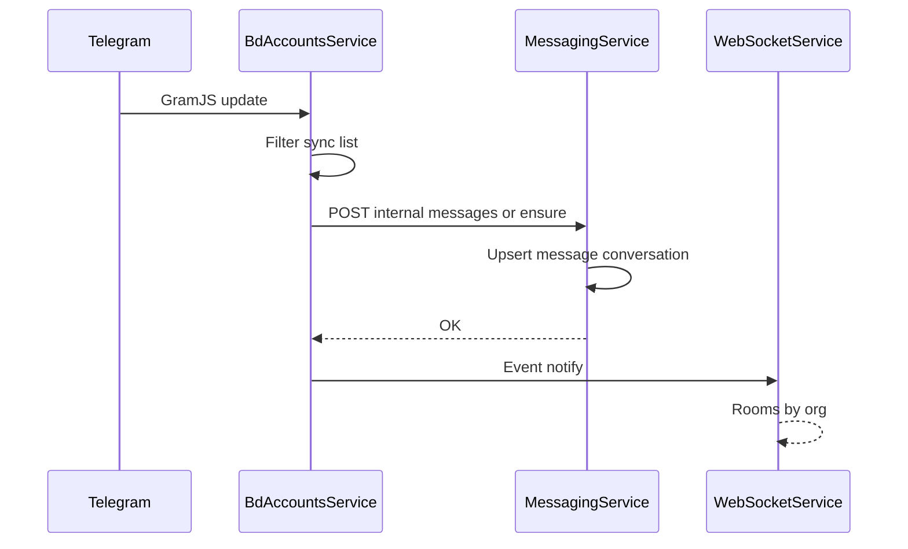
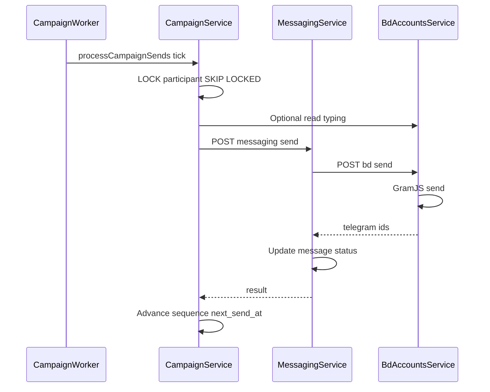

# Целевая архитектура: SaaS CRM с Telegram, синхронизацией и outreach

| Поле | Значение |
|------|----------|
| **Версия** | 1.0 |
| **Дата** | 2026-03-20 |
| **Связанные документы** | [CURRENT_SYSTEM_AS_IS.md](CURRENT_SYSTEM_AS_IS.md) (как сейчас), [MIGRATION_TO_TARGET_ARCHITECTURE.md](MIGRATION_TO_TARGET_ARCHITECTURE.md) (план перехода) |
| **База знаний** | [ARCHITECTURE.md](ARCHITECTURE.md), [MASTER_PLAN_MESSAGING_FIRST_CRM.md](MASTER_PLAN_MESSAGING_FIRST_CRM.md), [TABLE_OWNERSHIP_A1.md](../ai_docs/develop/TABLE_OWNERSHIP_A1.md) |

Этот документ описывает **целевое** состояние системы с точки зрения системного архитектора и практик нагруженных B2B SaaS CRM: мульти-тенантность, стабильный Telegram-слой, фоновые рассылки, парсинг/дискавери и наблюдаемость. Он не дублирует пошаговые флоу из остальных файлов, а задаёт **принципы и границы**.

---

## 1. Контекст и границы системы

**Пользователи и воркспейсы.** Каждая бизнес-операция выполняется в контексте организации (`organization_id`). Пользователь аутентифицируется централизованно; роль и членство определяют доступ к CRM, мессенджеру, BD-аккаунтам, кампаниям и настройкам.

**Внешние системы.**

- **Telegram (GramJS)** — источник истины для доставки/статусов сообщений на стороне мессенджера; ограничен лимитами и флудвейтом.
- **Платёжный провайдер** (например Stripe) — подписки и биллинг.
- **AI-провайдер** — необязательные функции (саммари, черновики, обогащение текстов); должен быть изолирован сбоем (circuit breaker, таймауты).

**Граница продукта.** Продукт объединляет: CRM (компании, контакты, сделки), воронку лидов, операционный мессенджер с выбранными чатами, подключённые Telegram-аккаунты BD, поиск/импорт из Telegram, кампании холодного outreach и автоматизацию. Целевая эволюция — **unified inbox / омниканал** поверх общей модели `channel` + `conversation` (см. MASTER_PLAN); в первой очереди канал — Telegram.

---

## 2. Доменные возможности: синхронные и асинхронные сценарии

| Область | Синхронно (HTTP / быстрый ответ) | Асинхронно (очереди, воркеры, длительные задачи) |
|---------|----------------------------------|--------------------------------------------------|
| **CRM** | CRUD сущностей, поиск, валидация | Массовый импорт/экспорт, тяжёлая аналитика |
| **Воронка** | CRUD лидов, канбан, переходы стадий | Автоправила, SLA-триггеры |
| **BD-аккаунты** | Подключение, статус сессии, точечные операции | Полная синхронизация чатов/истории, переподключение |
| **Мессенджер** | Список чатов, отправка сообщения (инициация), отметка прочитанного | Догрузка истории, репликация больших объёмов апдейтов из TG |
| **Парсинг / discovery** | Старт задачи, resolve ссылок | Обход участников, ротация аккаунтов, прогресс (SSE/стрим) |
| **Кампании** | Старт/пауза, CRUD шаблонов | Цикл отправок, humanization (typing/read), backoff |
| **AI** | Короткие запросы с таймаутом | Пакетная обработка — только через очередь |

**Правило:** всё, что может занять секунды и упирается во внешние лимиты, **не блокирует** пользовательский HTTP-запрос без явного UX «ожидания» и идемпотентного возобновления.

---

## 3. Целевая декомпозиция сервисов и владение данными

Принцип: **один владелец таблицы (aggregate)** — единственный сервис, который выполняет INSERT/UPDATE/DELETE в этой таблице. Остальные — только через **публичный или internal HTTP API**, либо через **доменные события** с идемпотентными consumer’ами.

**Целевая матрица (упрощённо):**

| Данные | Владелец записи | Потребители |
|--------|-----------------|-------------|
| Пользователи, организации, сессии | Auth | Все (чтение контекста из JWT/заголовков) |
| Профили, подписки | User | Gateway, CRM UI |
| BD-аккаунты, sync-чаты, папки, сессии GramJS | BD Accounts | Messaging, CRM (discovery), Campaign |
| Сообщения, беседы (conversations) | Messaging | BD Accounts (только через internal API), Campaign (отправка через API) |
| Компании, контакты, сделки, источники TG в CRM | CRM | Campaign (аудитория, read-only где зафиксировано), Pipeline |
| Воронки, стадии, лиды | Pipeline | CRM UI, Automation, Campaign |
| Кампании, участники, отправки | Campaign | CRM, Messaging |
| Правила автоматизации, исполнения | Automation | Event bus |
| AI usage, черновики | AI | Messaging, Campaign |

**Запрещено в целевом состоянии:** прямой SQL из сервиса A в таблицы владельца B, кроме явно оговорённых read-only представлений или миграций под контролем владельца.

**События (RabbitMQ).** Схемы событий версионируются или несут `schemaVersion`; consumer’ы идемпотентны (повтор доставки не ломает состояние). Критичные цепочки допускают **outbox** в БД владельца + публикацию воркером для атомарности «запись + событие».

---

## 4. Надёжность под нагрузку

- **Межсервисные вызовы:** retry с джиттером, таймауты, **circuit breaker** на нестабильные зависимости (AI, BD при деградации TG).
- **Очереди:** visibility timeout, dead-letter queue (DLQ), метрики глубины очереди и возраста сообщения; ручной редрайв из DLQ в админ-процедурах.
- **Telegram:** учёт FloodWait, лимитов на аккаунт и организацию; ротация аккаунтов в парсинге; backoff в поиске и массовых операциях (см. идеи в [PLAN_TELEGRAM_PARSE_FLOW.md](PLAN_TELEGRAM_PARSE_FLOW.md)).
- **Кампании:** rate limit по каналу и BD-аккаунту; очередь отправок не «догоняет» лимиты ценой бана; human simulation не блокирует критичный путь при сбое необязательных шагов (read/typing).
- **Идемпотентность:** создание лида/сделки по событию, upsert сообщений по `(bd_account_id, channel_id, telegram_message_id)` и т.п.

---

## 5. Консистентность данных

- **Источник истины:** для текста и метаданных сообщения в CRM — запись в PostgreSQL под владельцем Messaging; Telegram может опережать или отставать; при расхождении политика слияния документирована (например приоритет edit/delete событий из TG).
- **Sync-список чатов:** владелец — BD Accounts; Messaging получает срез только через контракт (internal API), без прямого чтения чужих таблиц во всех путях.
- **SLA:** для списка чатов и доставки — целевые p95 латентности; для полной консистентности истории после сбоя — eventual consistency с явным статусом «синхронизация» в UI.

---

## 6. Безопасность

- Публичный трафик только через **API Gateway**; downstream защищены `X-Internal-Auth` ([AUTH_ARCHITECTURE.md](../shared/service-core/src/AUTH_ARCHITECTURE.md)).
- **Tenant:** `organization_id` всегда из доверенного контекста (JWT / проверенный internal вызов с заголовком организации), не из тела запроса без проверки членства.
- **Internal API:** обязательные заголовки для операций с сообщениями; в production — обобщённые сообщения об ошибках валидации, детали только в логах.
- **Секреты:** не по умолчанию в dev/staging; ротация и хранение в секрет-хранилище в проде.
- **Аудит:** критичные действия (удаление аккаунта, смена ролей, экспорт) логируются в `audit_logs` с привязкой к org/user/ip.

---

## 7. Наблюдаемость

- **Логи:** структурированные, correlation id на всей цепочке gateway → сервисы → внешние вызовы.
- **Метрики:** RPS, латентность, error rate по маршрутам; бизнес-метрики (отправки кампаний, ошибки TG, глубина очередей).
- **Трейсинг:** distributed tracing (например OpenTelemetry) для сценариев «отправка сообщения» и «шаг кампании».
- **SLO (пример целей):** успешная доставка инициированной пользователем отправки; отсутствие необработанных DLQ за окно N минут; доступность health/ready.

---

## 8. Целевые потоки (Mermaid)

### 8.1 Входящее сообщение из Telegram

### 8.2 Шаг кампании (outreach)

---

## 9. Эволюция (после стабилизации ядра)

- Unified inbox: абстракция каналов и единый timeline по контакту.
- Расширение RBAC и квот по организации.
- Партиционирование/архивация больших таблиц сообщений при росте объёма.

Дальнейшие шаги по внедрению целевой модели в кодовую базу — в [MIGRATION_TO_TARGET_ARCHITECTURE.md](MIGRATION_TO_TARGET_ARCHITECTURE.md).
