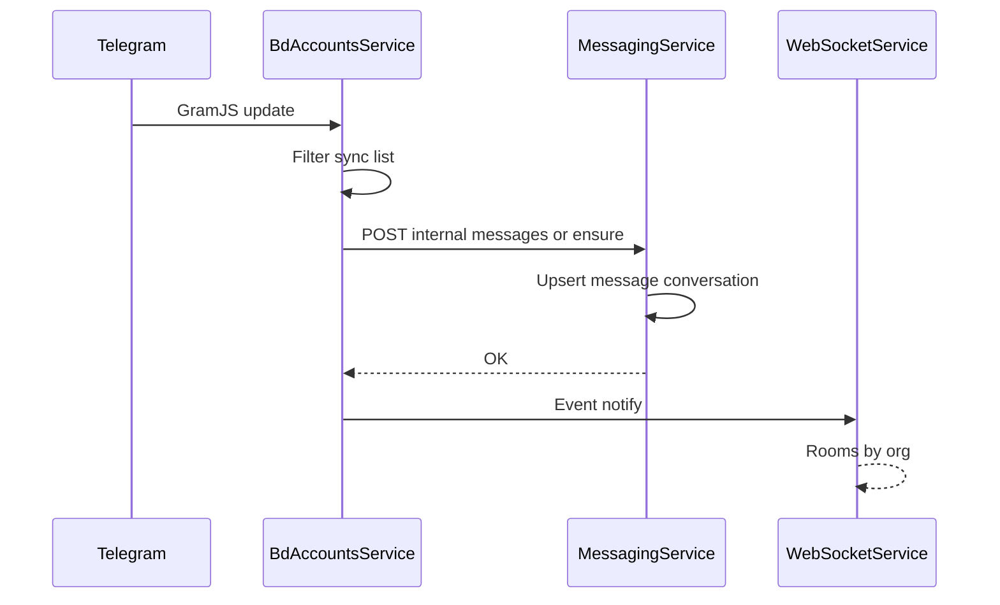
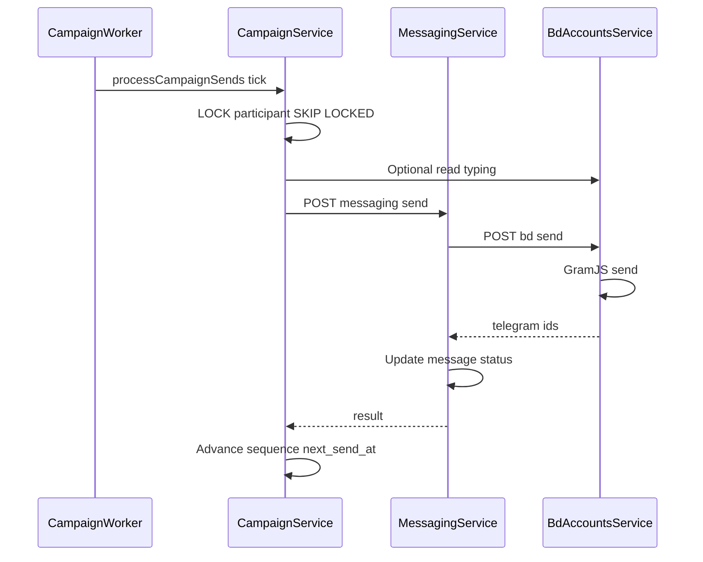

# Архитектура CRM

**Дата обновления:** 2026-04-06

---

## 1. Контекст и границы системы

**Пользователи и воркспейсы.** Каждая бизнес-операция выполняется в контексте организации (`organization_id`). Пользователь аутентифицируется централизованно; роль и членство определяют доступ к CRM, мессенджеру, BD-аккаунтам, кампаниям и настройкам.

**Внешние системы:**

- **Telegram (GramJS)** — источник истины для доставки/статусов сообщений; ограничен лимитами и FloodWait.
- **Платёжный провайдер** (Stripe) — подписки и биллинг.
- **AI-провайдер** (OpenAI / OpenRouter) — необязательные функции (саммари, черновики, обогащение текстов); изолирован сбоем (circuit breaker, таймауты).

**Граница продукта.** Продукт объединяет: CRM (компании, контакты, сделки), воронку лидов, операционный мессенджер с выбранными чатами, подключённые Telegram-аккаунты BD, поиск/импорт из Telegram, кампании холодного outreach и автоматизацию. Целевая эволюция — **unified inbox / омниканал** поверх общей модели `channel` + `conversation` (см. [MASTER_PLAN](../product/MASTER_PLAN.md)); в первой очереди канал — Telegram.

---

## 2. Инфраструктура

- **PostgreSQL** — основная БД для всех сервисов: пользователи, организации, CRM, воронки, лиды, сообщения, чаты, кампании, команды, автоматизация. Схема и миграции: Knex ([MIGRATIONS](../operations/MIGRATIONS.md)).
- **Redis** — кеш, сессии, pub/sub для WebSocket, rate limiting (API Gateway, AI rate limit).
- **RabbitMQ** — очереди событий для event-driven коммуникации между сервисами.
- **Prometheus** — метрики (prom-client, endpoint `/metrics` на сервисах).
- **Grafana / Jaeger** — визуализация метрик и distributed tracing.

MongoDB и Elasticsearch **не используются**.

**Общее ядро кода:** Express, bootstrap через `@getsale/service-core` (`createServiceApp`: пул PostgreSQL, RabbitMQ, метрики, health/ready, internal auth, graceful shutdown). `asyncHandler`, `validate(Zod)`, `AppError`, `withOrgContext`, `ServiceHttpClient` с retry/circuit breaker.

**Фронтенд:** Next.js App Router (`frontend/app`), Zustand, axios `apiClient`, Tailwind.

---

## 3. Микросервисы

| Сервис | Назначение |
|--------|------------|
| **API Gateway** | Единая точка входа, JWT, rate limiting, проксирование на бэкенды |
| **Auth Service** | Регистрация, вход, JWT (access + refresh), организации, 2FA (TOTP) |
| **User Service** | Профили, подписки (Stripe), команды |
| **BD Accounts Service** | BD/Telegram аккаунты (GramJS): подключение, синхронизация чатов, отправка; фасад `telegram/index.ts`, FloodWait-retry |
| **CRM Service** | Компании, контакты, сделки, заметки, напоминания; Contact Discovery / parse задачи |
| **Pipeline Service** | Воронки, стадии, лиды, история переходов (stage_history) |
| **Messaging Service** | Чаты, сообщения, conversations, lead-context, отправка через BD Accounts |
| **Automation Service** | Правила автоматизации, триггеры (в т.ч. lead.stage.changed → создание сделки) |
| **Analytics Service** | Метрики конверсии, аналитика воронки, отчёты по командам |
| **Team Service** | Команды, участники, назначения клиентов |
| **WebSocket Service** | Real-time обновления (Socket.io, Redis adapter) |
| **AI Service** | Summarize, analyze, генерация черновиков, campaign rephrase (OpenAI/OpenRouter) |
| **Campaign Service** | Cold outreach: кампании, последовательности, участники, воркер отправок |
| **Activity Service** | Лента активности организации |

Детальное описание API — в [CRM_API](../api/CRM_API.md), [INTERNAL_API](../api/INTERNAL_API.md) и в коде маршрутов `services/<name>/src/routes/`.

---

## 4. Синхронные и асинхронные сценарии

| Область | Синхронно (HTTP / быстрый ответ) | Асинхронно (очереди, воркеры, длительные задачи) |
|---------|----------------------------------|--------------------------------------------------|
| **CRM** | CRUD сущностей, поиск, валидация | Массовый импорт/экспорт, тяжёлая аналитика |
| **Воронка** | CRUD лидов, канбан, переходы стадий | Автоправила, SLA-триггеры |
| **BD-аккаунты** | Подключение, статус сессии, точечные операции | Полная синхронизация чатов/истории, переподключение |
| **Мессенджер** | Список чатов, отправка сообщения, отметка прочитанного | Догрузка истории, репликация апдейтов из TG |
| **Парсинг / discovery** | Старт задачи, resolve ссылок | Обход участников, ротация аккаунтов, прогресс (SSE) |
| **Кампании** | Старт/пауза, CRUD шаблонов | Цикл отправок, humanization (typing/read), backoff |
| **AI** | Короткие запросы с таймаутом | Пакетная обработка — только через очередь |

**Правило:** всё, что может занять секунды и упирается во внешние лимиты, **не блокирует** пользовательский HTTP-запрос без явного UX «ожидания» и идемпотентного возобновления.

---

## 5. Владение данными (Data Ownership)

Принцип: **один владелец таблицы (aggregate)** — единственный сервис, который выполняет INSERT/UPDATE/DELETE в этой таблице. Остальные — только через **публичный или internal HTTP API**, либо через **доменные события** с идемпотентными consumer'ами.

| Данные | Владелец записи | Потребители |
|--------|-----------------|-------------|
| Пользователи, организации, сессии | Auth | Все (чтение контекста из JWT/заголовков) |
| Профили, подписки | User | Gateway, CRM UI |
| BD-аккаунты, sync-чаты, папки, сессии GramJS | BD Accounts | Messaging, CRM (discovery), Campaign |
| Сообщения, беседы (conversations) | Messaging | BD Accounts (только через internal API), Campaign (отправка через API) |
| Компании, контакты, сделки, источники TG в CRM | CRM | Campaign (аудитория, read-only), Pipeline |
| Воронки, стадии, лиды | Pipeline | CRM UI, Automation, Campaign |
| Кампании, участники, отправки | Campaign | CRM, Messaging |
| Правила автоматизации, исполнения | Automation | Event bus |
| AI usage, черновики | AI | Messaging, Campaign |

**Запрещено:** прямой SQL из сервиса A в таблицы владельца B, кроме явно оговорённых read-only представлений под контролем владельца. Задокументированные исключения и метрики bypass — см. [TABLE_OWNERSHIP](TABLE_OWNERSHIP.md).

Детальный маппинг контактов: **CRM Service** создаёт и обновляет контакты; **Campaign Service** не пишет в `contacts` / `contact_telegram_sources` — только чтение для аудитории.

---

## 6. Event-Driven архитектура

Сервисы обмениваются событиями через RabbitMQ:

- **User & Auth:** `user.created`, `user.updated`, `subscription.created`
- **BD Accounts:** `bd_account.connected`, `bd_account.disconnected`
- **CRM & Pipeline:** `contact.created`, `contact.updated`, `deal.created`, `deal.stage.changed`, `lead.stage.changed`
- **Messaging:** `message.received`, `message.sent`
- **Automation:** `automation.rule.triggered`
- **AI:** `ai.draft.generated`, `ai.draft.approved`

**События (RabbitMQ):** схемы событий несут `schemaVersion`; consumer'ы идемпотентны (повтор доставки не ломает состояние). Критичные цепочки допускают **outbox** в БД владельца + публикацию воркером для атомарности «запись + событие». Correlation ID прокидывается для трассировки.

---

## 7. Надёжность

- **Межсервисные вызовы:** `ServiceHttpClient` с retry, джиттер, таймауты, **circuit breaker** на нестабильные зависимости (AI, BD при деградации TG). Конфигурация через env `SERVICE_HTTP_*`. Инвентаризация: [SERVICE_HTTP_CLIENT_INVENTORY](../api/SERVICE_HTTP_CLIENT_INVENTORY.md).
- **Очереди:** visibility timeout, dead-letter queue (DLQ), метрики глубины очереди и возраста сообщения; ручной редрайв из DLQ.
- **Telegram:** учёт FloodWait (`telegramInvokeWithFloodRetry`), лимитов на аккаунт и организацию; ротация аккаунтов в парсинге; backoff в поиске и массовых операциях. См. [TELEGRAM_PARSE_FLOW](../domain/TELEGRAM_PARSE_FLOW.md).
- **Кампании:** rate limit по каналу и BD-аккаунту (`CAMPAIGN_MIN_GAP_MS_SAME_BD_ACCOUNT`); очередь отправок не «догоняет» лимиты ценой бана; human simulation не блокирует критичный путь при сбое необязательных шагов.
- **Идемпотентность:** создание лида/сделки по событию с 409, upsert сообщений по `(bd_account_id, channel_id, telegram_message_id)`, `automation_executions`.
- **Транзакции:** BEGIN/COMMIT/ROLLBACK для многозначных операций.
- **Миграции БД:** Knex, без ручного изменения схемы в проде.

---

## 8. Консистентность данных

- **Источник истины:** для текста и метаданных сообщения в CRM — запись в PostgreSQL под владельцем Messaging; Telegram может опережать или отставать; при расхождении приоритет edit/delete событий из TG.
- **Sync-список чатов:** владелец — BD Accounts; Messaging получает срез только через internal API, без прямого чтения чужих таблиц.
- **SLA:** для списка чатов и доставки — целевые p95 латентности; для полной консистентности истории после сбоя — eventual consistency с явным статусом «синхронизация» в UI.

---

## 9. Безопасность

- Публичный трафик только через **API Gateway**; downstream защищены `X-Internal-Auth` ([AUTH_ARCHITECTURE](../../shared/service-core/src/AUTH_ARCHITECTURE.md)).
- **Tenant:** `organization_id` всегда из доверенного контекста (JWT / проверенный internal вызов с заголовком организации), не из тела запроса без проверки членства.
- **RBAC:** роли (owner, admin, supervisor, bidi, viewer), `role_permissions` для ресурсов (в т.ч. messaging, bd_accounts).
- **Internal API:** обязательные заголовки для операций с сообщениями; в production — обобщённые сообщения об ошибках валидации, детали только в логах.
- **Rate limiting:** на API Gateway (Redis).
- **Секреты:** переменные окружения; в проде — Kubernetes Secrets / Vault. Ротация и хранение в секрет-хранилище.
- **Аудит:** критичные действия (удаление аккаунта, смена ролей, экспорт) логируются в `audit_logs`.

---

## 10. Наблюдаемость

- **Логи:** `@getsale/logger`, структурированные, correlation ID на цепочке gateway → сервисы → внешние вызовы.
- **Метрики:** Prometheus, `/metrics`, нормализация путей; бизнес-метрики (отправки кампаний, ошибки TG, глубина очередей); межсервисные счётчики `inter_service_http_*` с алертами.
- **Health:** `/health` на gateway и сервисах (проверка БД, RabbitMQ).
- **Трейсинг:** distributed tracing (OpenTelemetry / Jaeger) для сценариев «отправка сообщения» и «шаг кампании».
- **SLO (целевые):** успешная доставка инициированной пользователем отправки; отсутствие необработанных DLQ за окно N минут; доступность health/ready.

---

## 11. Contact Discovery

Модуль поиска и импорта контактов из Telegram-групп и каналов. Поиск — **глобальный** (по всему Telegram). Два способа добавления чатов: **поиск по ключевым словам** (с фильтром: группы / каналы / оба) и **по ссылкам** (t.me/…, @username, инвайты). Участники импортируются в CRM; опции: исключить админов, выйти из чата после импорта. См. [CRM_API](../api/CRM_API.md), [TELEGRAM_PARSE_FLOW](../domain/TELEGRAM_PARSE_FLOW.md).

---

## 12. Потоки данных (Mermaid)

### 12.1 Входящее сообщение из Telegram

### 12.2 Шаг кампании (outreach)

---

## 13. Масштабирование

- Сервисы stateless; состояние в PostgreSQL и Redis.
- WebSocket: Redis adapter для горизонтального масштабирования.
- API Gateway: единая точка входа; в проде — load balancing.
- Пул БД: в коде ограничен; рекомендация PgBouncer в проде.

---

## 14. Развёртывание

- **Локальная разработка:** `docker-compose up -d` ([GETTING_STARTED](../operations/GETTING_STARTED.md)).
- **Продакшен:** манифесты в `k8s/`; `kubectl apply -f k8s/`. Подробнее: [DEPLOYMENT](../operations/DEPLOYMENT.md).

---

## 15. Эволюция (после стабилизации ядра)

- Unified inbox: абстракция каналов и единый timeline по контакту.
- Расширение RBAC и квот по организации.
- Партиционирование/архивация больших таблиц сообщений при росте объёма.
- Омниканал: WhatsApp, Email, Instagram DM.

Оставшиеся задачи и приоритеты: [ROADMAP](../ROADMAP.md).
